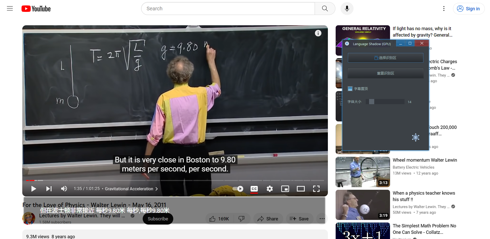

<p align="center">
    
</p>

<div align="center">

[](https://github.com/rerender2021/language-shadow/actions/workflows/build.yml) [](https://github.com/rerender2021/language-shadow/actions/workflows/pack.yml)

 </div>
 
# 简介

文影 (Language Shadow) 是一个简单的翻译器，原理：

-   使用 OCR 识别指定区域，获得文字用于翻译。目前支持离线情况下，英文翻译成中文。
-   GUI 部分则是使用 [Ave React](https://qber-soft.github.io/Ave-React-Docs/) 开发的。



演示视频见:

- [发布 文影 (Language Shadow) 1.0.0](https://rerender2021.github.io/blog/language-shadow-1.0.0/)
# 安装

-   下载文影可执行文件: https://github.com/rerender2021/language-shadow/releases/tag/1.0.0

解压缩后得到 `language-shadow.exe`，这是一个 GUI 应用，OCR 和翻译的功能则是由服务器提供的。

由于是离线使用的，需要额外下载两个服务器，并解压缩和 exe 放在一起：

-   OCR 服务器：https://github.com/rerender2021/PaddleocrAPI/releases/tag/1.0.1
-   翻译服务器：https://github.com/rerender2021/NLP-API/releases/tag/1.0.1

下载它们，并解压到 exe 所在目录，确保目录结构如下，这样当 GUI 启动时，它们能被识别，从而自动启动：

```
- nlp-server
- ocr-server
- language-shadow.exe
```

双击 `language-shadow.exe` 即可运行。

## 扩展

运行过程中，OCR 和翻译会请求本地接口，因此，不使用以上离线服务器，而是自己起一个服务器对接在线 API，也可正常使用。

相关接口和数据结构约定见代码：

-   OCR: [./src/ocr/paddle-ocr.ts](./src/ocr/paddle-ocr.ts)
-   翻译: [./src/nlp/helsinki-nlp.ts](./src/nlp/helsinki-nlp.ts)

# 开发

```bash
> npm install
> npm run dev
```

开发过程中需要确保本机启动了 OCR 服务器和翻译服务器。

-   OCR 服务器：https://github.com/rerender2021/PaddleocrAPI/releases/tag/1.0.1
-   翻译服务器：https://github.com/rerender2021/NLP-API/releases/tag/1.0.1

下载它们，并解压到项目下，确保项目目录结构如下：

```
- nlp-server
    - NLP-API.exe
    - ...
- ocr-server
    - PaddleocrAPI.exe
    - ...
- src
- ...
- package.json
```

# 打包

-   生成 exe

```bash
> npm run release
```

-   将 `ocr-server` 和 `nlp-server` 复制到 `bin` 目录中，和 exe 一起压缩打包。

# 开源协议

[MIT](./LICENSE)
